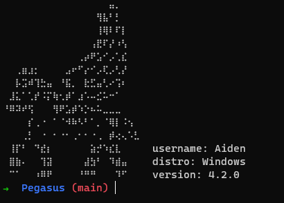

# Pegasus - OS-Based Hacking Shell

    

## IMPORTANT NOTICE
Please be aware that if you are operating on a Darwin system with arch=amd64 or Linux with arch=arm, it is essential to either build the software from source or install it using Docker.

<!-- TOC -->
- [Introduction](#introduction)
- [Requirements](#requirements)
- [Usage](#usage)
- [Prompt Styles](#prompt-styles)
- [Docker Installation](#docker-installation)
    - [Local Install](#local-install)
    - [Docker Hub Install](#docker-hub-install)
- [Binary Install](#install-the-binary-recommend)
- [Contribution](#contribution)
- [License](#license)
- [Disclaimer](#disclaimer)
- [Todo](#todo)
<!-- TOC -->

## Introduction

Pegasus is a powerful hacking shell designed for Unix-based operating systems. It provides various tools and functionalities that can be used for security testing and ethical hacking purposes. This tool is intended for educational and responsible use only. Please use it responsibly and with proper authorization.

## Requirements

Linux

<code>sudo apt install libpcap-dev</code> 

Windows

<code>Install [npcap](https://npcap.com/)</code>

## Usage

### Note
If you install the binary for any OS you will need to make the file a sudo binary
- Linux
    `sudo chown root:root /path/to/your/executable`
    `sudo chmod u+s /path/to/your/executable`
- Mac
    `sudo visudo`
    `yourusername ALL=(ALL) NOPASSWD: /path/to/your/executable`
- Windows
    `Run as Administrator`

Once Pegasus is successfully installed, you can run it by executing the `go run main.go` command in your terminal:

If you want a new style prompt run `./pegasus -style=<prompt>`
## Prompt styles

- windows
- root
- zsh, zsh-git
- mac
- hacker

## Docker installation

### Local install
If you prefer to build the Docker image locally, execute the following commands:

`docker build -t pegasus .`

`docker run -it pegasus`

### Docker hub install (recommend for arm)
For a more straightforward installation, you can pull the Docker image from Docker Hub:

`docker pull nebrix/pegasus:4.3.0`

`docker run -it docker.io/nebrix/pegasus:4.3.0`

Using the Docker Hub image is the recommended and easier approach for most users.

## Install the binary (recommend)

Download the binary [pegasus](https://github.com/Nebrix/Pegasus/releases)

## Todo

- [X] Simple Tools
    - [X] Whois - 1
    - [X] Dns - 2
    - [X] Hashing - 3
    - [X] ip/ip information - 4
    - [X] subnet claculator -5
- [ ] Advanced Tools
    - [X] PortScanner - 1
    - [X] Packet Sniffer - 2
    - [ ] Discover Wifi Networks - 3
- [ ] User customizability
    - [X] Shell Prompt styles - 1
    - [ ] Custom Prompt styles - 2

## Contribution

If you find any bugs or want to contribute to Pegasus, please feel free to open an issue or submit a pull request on the GitHub repository. We welcome your feedback and suggestions to make this tool even better.

## License

Pegasus is open-source software licensed under the [MIT License](https://github.com/Codezz-ops/Pegasus-Go/blob/main/COPYING). You are free to use, modify, and distribute this software with proper attribution and in compliance with the license terms.

## Disclaimer

Pegasus is provided for educational and ethical hacking purposes only. The authors and contributors of Pegasus are not responsible for any misuse or illegal activities performed using this tool. Please use it responsibly and in compliance with the laws and regulations of your country.
